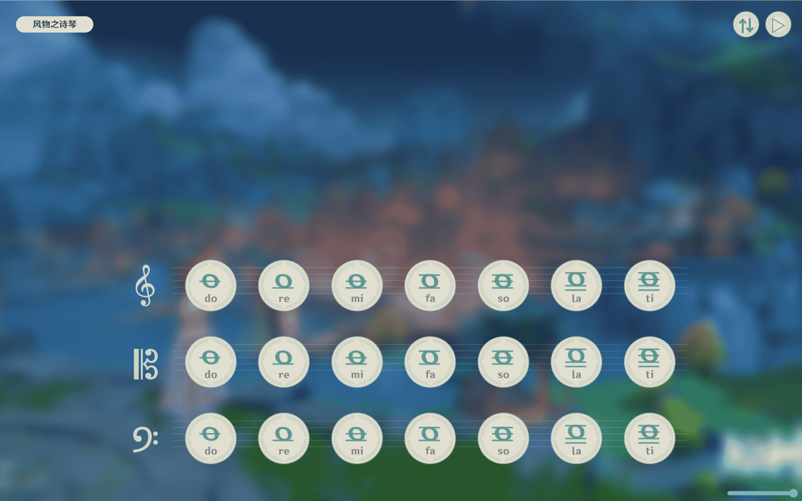
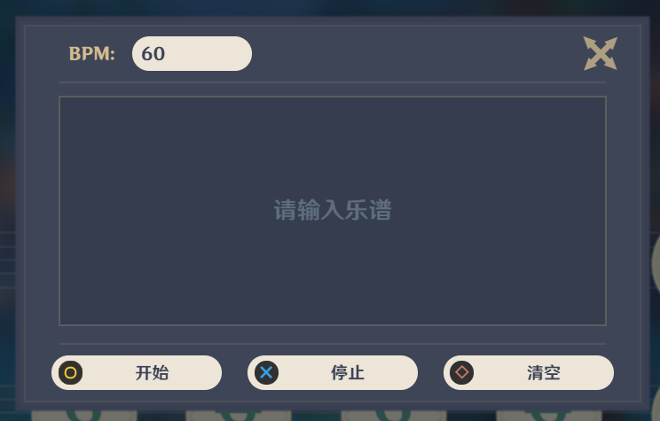

# 原神风物之诗琴模拟器 · Windsong Lyre Simulator

> 在浏览器中弹奏原神「风物之诗琴」—— 支持 8 种乐器、自动演奏、转调、移动端适配。

[在线使用](https://julardepick.github.io/demo/WindsongLyre-Simulator.fork) | [更新日志](Update_Log.md)



---

## 项目来源

本项目 Fork 自 [VanillaNahida/WindsongLyre-Sim](https://github.com/VanillaNahida/WindsongLyre-Sim)，在此基础上做了如下更新：

- **bug修复**
  - 修复了同时打开多个功能弹窗的bug
  - 修复了大写状态下字母按键无响应的bug
  - 修复了离线/兼容模式下音量控制拖动条失效的bug
- **体验优化**
  - 优化了部分UI控件的样式
  - 禁用了 Tab 键，避免浏览器聚焦到UI控件上影响体验
- **新增功能**
  - 新增了快捷键 `ESC` ，用于关闭已打开的弹窗

## 乐器列表

| 乐器 | 英文名 |
|------|--------|
| 风物之诗琴 | Windsong Lyre |
| 镜花之琴 | Floral Zither |
| 镜花之琴（旧版） | Floral Zither (Old) |
| 老旧的诗琴 | Vintage Lyre |
| 悠可琴 | Ukulele |
| 「余音」 | Lingering Euphonia |
| 谐律键琴 | Harmonic Key |
| 跃律琴 | Leaping Spirit Piano |

## 键盘映射

三排键盘按键对应三个八度，覆盖 21 个音符：

| 行 | 按键 | 音域 |
|----|------|------|
| 上排 | `Q` `W` `E` `R` `T` `Y` `U` | 高八度 |
| 中排 | `A` `S` `D` `F` `G` `H` `J` | 中八度 |
| 下排 | `Z` `X` `C` `V` `B` `N` `M` | 低八度 |

## 自动演奏

点击右上角播放按钮，输入乐谱即可自动弹奏。支持设置 BPM 和转调。



### 乐谱格式

使用按键字母编写乐谱，括号 `()` 内为和弦同时弹奏，`|` 后接数字控制节奏。

## 转调

支持 7 种调式：Ionian、Dorian、Phrygian、Lydian、Mixolydian、Aeolian、Locrian，可配合半音偏移实现任意转调。

## 本地运行

直接打开 `index.html` 浏览器会因跨域限制进入兼容模式，部分功能受限（无音频压缩器、无转调、音效截断）。建议通过本地 HTTP 服务器运行：

```bash
# Python 3
python -m http.server 8000

# Node.js (npx)
npx serve .
```

然后访问 `http://localhost:8000`。

## 技术实现

- **Web Audio API** — AudioContext + DynamicsCompressorNode + GainNode 构建音频管线
- **XMLHttpRequest** — 加载音频资源，失败自动降级为 `<audio>` 兼容模式
- **PWA** — Web App Manifest，支持添加到主屏幕全屏运行
- **纯前端** — 无框架依赖，原生 HTML / CSS / JavaScript

---

本 Fork 由 [@JularDepick](https://github.com/JularDepick) 维护，基于 [VanillaNahida/WindsongLyre-Sim](https://github.com/VanillaNahida/WindsongLyre-Sim)。
